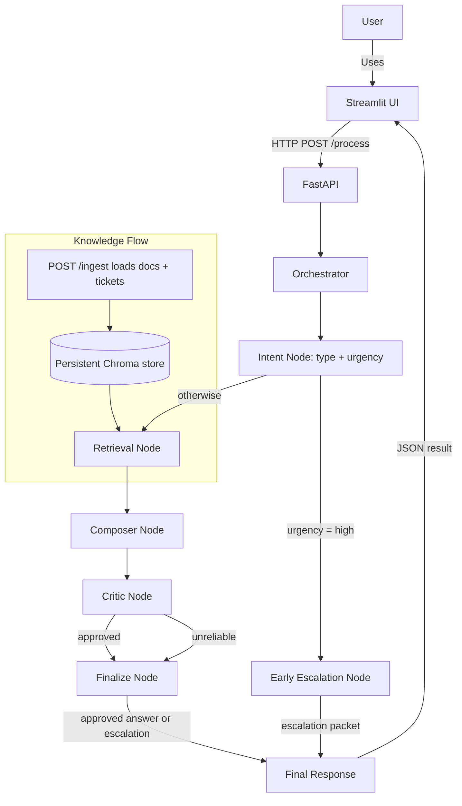

# InsightDesk — Detailed Explanation

## What is InsightDesk?
InsightDesk is an agentic customer-support assistant written in Python. Given a
customer question, it classifies the request, searches a knowledge base, composes
a grounded answer with citations, critiques that answer for reliability, and
either returns it or escalates the case to a human with a structured handoff
packet.

## Who is this for?
This guide is written for a general audience — you do not need to be a developer
to follow the first sections. It explains what the project does, how its parts
fit together, and how a request travels from a question to a final answer.
Developers will also find the endpoint contracts, configuration table, run
instructions, and architecture diagram useful.

## Main idea
When someone asks a question, InsightDesk:
- reads and **classifies** the question (its type and urgency),
- if the question is **urgent**, routes it straight to a human (skipping the rest),
- otherwise **retrieves** the most relevant documents from the knowledge base,
- **composes** an answer grounded in — and citing — those documents,
- **critiques** whether the answer is well-supported and confident,
- and either **returns** the answer or **escalates** it for human review.

## Architecture at a glance

| Layer | Responsibility | Key files |
| --- | --- | --- |
| Web API | REST endpoints, request tracing | [app/main.py](app/main.py) |
| Orchestrator | Builds the ticket, drives the graph, shapes the response | [app/agents/orchestrator.py](app/agents/orchestrator.py) |
| Graph runner | Compiles and runs the LangGraph `StateGraph` | [app/langgraph_runner.py](app/langgraph_runner.py) |
| Graph nodes | Thin wrappers binding each agent to a graph step | [app/langgraph_nodes/](app/langgraph_nodes/) |
| Agents | The actual logic: intent, retrieval, compose, critic, escalate | [app/agents/](app/agents/) |
| Knowledge base | Persistent ChromaDB vector store + embeddings | [app/agents/knowledge_agent.py](app/agents/knowledge_agent.py) |
| Data / RAG | Synthetic corpus generation and ingestion | [app/rag/](app/rag/) |
| Tools | Mocked external integrations (ticketing, notify) | [app/tools/mock_tools.py](app/tools/mock_tools.py) |
| UI | Streamlit browser front-end | [streamlit_app.py](streamlit_app.py) |
| Contracts | Pydantic v2 request/response/message models | [app/models.py](app/models.py), [app/langgraph_nodes/schemas.py](app/langgraph_nodes/schemas.py) |

## Key components

### 1. Web API layer (FastAPI)
The backend ([app/main.py](app/main.py)) exposes a REST service. On startup it
loads environment variables from `.env` (via `python-dotenv`) and constructs a
single shared `Orchestrator`.
- `GET /health` — liveness check.
- `POST /process` — submit a customer question to the agent pipeline.
- `POST /ingest` — (re)load the knowledge base into the vector store.
- `GET /docs/{doc_id}` — retrieve a stored document by its id (404 if missing).

### 2. Streamlit user interface
A Streamlit app ([streamlit_app.py](streamlit_app.py)) provides a friendly
browser UI on top of the API so non-technical users never have to touch `curl`
or JSON. It offers a sidebar with a live health indicator and an ingest button,
an **Ask a question** tab that renders the answer / escalation status /
citations / trace id, and a **Lookup document** tab. It is a thin HTTP client —
the FastAPI backend remains the single source of truth.

### 3. Knowledge storage (ChromaDB)
InsightDesk stores its searchable data in a **persistent** ChromaDB vector store
([app/agents/knowledge_agent.py](app/agents/knowledge_agent.py)):
- documents and ticket resolutions are embedded with `all-MiniLM-L6-v2`,
- the collection uses cosine distance and is written to disk via a
  `PersistentClient`, so it survives restarts (location set by
  `CHROMA_PERSIST_DIR`),
- ingestion is idempotent (`upsert`), so re-ingesting the same ids overwrites
  rather than duplicates them.

### 4. Retrieval and answer composition
When a non-urgent question arrives, the system retrieves context and composes an
answer:
- retrieval returns the top matches as citations, each with a **relevance score
  in `(0, 1]` where higher is better** (ChromaDB reports a raw distance where
  lower is better, which is converted to this score by `1 / (1 + distance)`),
- the answer composer ([app/agents/answer_composer.py](app/agents/answer_composer.py))
  builds a grounded answer that cites the source documents. In mock mode
  (`MOCK_LLM=true`) it produces a deterministic summary; otherwise it calls the
  OpenAI Chat Completions API.

### 5. Critic and escalation
After a draft is composed, the critic
([app/agents/critic_agent.py](app/agents/critic_agent.py)) reviews it:
- if there are **no citations**, or the **best relevance score is below
  `CRITIC_MIN_SCORE`** (default `0.2`), the answer is deemed unreliable and the
  case is escalated,
- otherwise the answer is approved.

When a case escalates (either from urgency routing or the critic), the escalator
([app/agents/escalator.py](app/agents/escalator.py)) assembles a JSON handoff
packet containing the trace id, the query, the user, the draft answer, citations,
and the escalation reason.

### 6. Docker support
The project ships with [Dockerfile](Dockerfile) and
[docker-compose.yml](docker-compose.yml) so the backend can run inside a
container with a single command, with the vector store persisted to a mounted
volume.

## Workflow diagram
The diagram below shows the request pipeline, the conditional urgency routing,
and how the Streamlit UI and knowledge base connect to it.



## How the workflow works

### Step 1 — A question arrives
A user types a question in the Streamlit UI (or a client calls `POST /process`
directly). Each request gets a unique `trace_id` for end-to-end tracing.

### Step 2 — The orchestrator coordinates
The orchestrator wraps the question in a ticket payload and invokes the compiled
LangGraph `StateGraph`, passing `user_id` and `trace_id` as runtime context.

### Step 3 — Intent detection and routing
The intent node classifies the question into a type (bug, billing, how_to,
complaint, general) and an urgency (normal/high). A **conditional edge** then
routes the ticket: high-urgency tickets go straight to the early-escalation node
and skip retrieval and composition entirely; everything else proceeds down the
normal path.

### Step 4 — Document retrieval
For non-urgent questions, the system searches ChromaDB for the most relevant
content and returns the top matches as scored citations.

### Step 5 — Answer composition
The retrieved citations are passed to the composer, which drafts an answer
grounded in the knowledge base.

### Step 6 — Critic review
The critic examines the draft. If it lacks citations or its best supporting score
is too low, the case is escalated; otherwise it is approved.

### Step 7 — Final response
The finalize node returns the outcome: an approved answer, or — when the critic
escalates — an escalation marker with a structured handoff packet. (Urgent
tickets reach the same final shape directly via the early-escalation node.) The
Streamlit UI renders the result, including citations and the trace id.

## API contract

`POST /process`

Request:
```json
{ "query": "How do I export my data?", "user_id": "user-123" }
```

Response:
```json
{
  "trace_id": "…",
  "response": {
    "success": true,
    "text": "…",
    "citations": [ { "doc_id": "doc-1", "score": 0.54, "excerpt": "…" } ],
    "escalate": false,
    "escalation_packet": null
  }
}
```

`success` is `true` when the answer was approved (not escalated). When
`escalate` is `true`, `escalation_packet` holds the human handoff bundle.

## Configuration

The backend reads these from the environment (and from `.env` on startup):

| Variable | Default | Purpose |
| --- | --- | --- |
| `MOCK_LLM` | `true` | Use a deterministic mock composer instead of OpenAI. |
| `OPENAI_API_KEY` | — | Required only when `MOCK_LLM=false`. |
| `OPENAI_MODEL` | `gpt-3.5-turbo` | Model used in real-LLM mode. |
| `CHROMA_PERSIST_DIR` | `./data/chroma` | On-disk location of the vector store. |
| `RAG_DATA_DIR` | `./data` | Folder containing `docs.json` / `tickets.json`. |
| `CRITIC_MIN_SCORE` | `0.2` | Minimum top relevance score before the critic escalates. |
| `INSIGHTDESK_API_BASE` | `http://127.0.0.1:8000` | Backend URL used by the Streamlit UI. |

> **Security note:** never commit a real `OPENAI_API_KEY`. `.env` is gitignored;
> use `.env.example` as the template.

## Running the app

### Local Python mode (backend)
1. Create and activate a Python virtual environment.
2. Install requirements: `pip install -r requirements.txt`.
3. (Optional) Regenerate the demo corpus: `python app/rag/generate_data.py`.
4. (Optional) Pre-ingest the documents: `python -m app.rag.ingest` — the API
   also ingests automatically on startup.
5. Start the API: `uvicorn app.main:app --reload`.

### Streamlit UI
With the backend running, launch the UI in a second terminal:

```bash
streamlit run streamlit_app.py
```

Then open the URL Streamlit prints (default `http://localhost:8501`). If the API
is not on the default address, set it in the sidebar or via the
`INSIGHTDESK_API_BASE` environment variable before launching.

### Docker mode (backend)
```bash
docker compose up --build
```
The service is published on host port `8000`, knowledge data is stored in a
mounted `./data` folder, and ChromaDB persistence lives at `/data/chroma` inside
the container. Run the Streamlit UI locally pointed at `http://127.0.0.1:8000`.

### Tests
```bash
pytest -q
```
Tests force `MOCK_LLM=true` and monkeypatch retrieval, so they need no network
access or API keys.

## Engineering notes (what was hardened)
This project was reviewed and brought to a clean, runnable state. The notable
fixes:
- **`requirements.txt`** was a UTF-16-encoded full `pip freeze`; it is now a
  clean UTF-8 file pinning only the direct dependencies.
- **ChromaDB persistence** previously used an in-memory client and never wrote to
  disk; it now uses `PersistentClient`, so the store genuinely persists.
- **Urgency routing** was documented but never wired up; the graph now has a real
  conditional edge that escalates high-urgency tickets before retrieval.
- **Relevance scores** were raw distances (lower = better) but treated as scores
  (higher = better); retrieval now returns a normalised `(0, 1]` score and the
  critic uses a meaningful confidence threshold.
- **Intent classification** is unified in one place — the graph node delegates to
  `IntentClassifier` instead of duplicating its logic.
- **Environment loading** — `.env` is now actually loaded on startup, and
  `MOCK_LLM` is read per request rather than frozen at import time.
- Pydantic v2 `.model_dump()` replaces the deprecated `.dict()`.

## Why this project is useful
InsightDesk automates the first steps of answering customer questions: it triages
urgency, finds relevant information quickly, builds answers that cite their
sources, adds safety checks so uncertain or urgent cases reach a human, and
offers a simple UI so anyone on the team can use it.

## Summary
InsightDesk is a structured customer-support assistant built around a LangGraph
pipeline: receive the question, classify it, route urgent cases to a human,
retrieve and compose a grounded answer, verify it, and either return it or
escalate it. The FastAPI endpoints provide a programmatic interface, the
Streamlit UI provides a friendly front end, and the Docker setup makes the
backend easy to run end-to-end.
