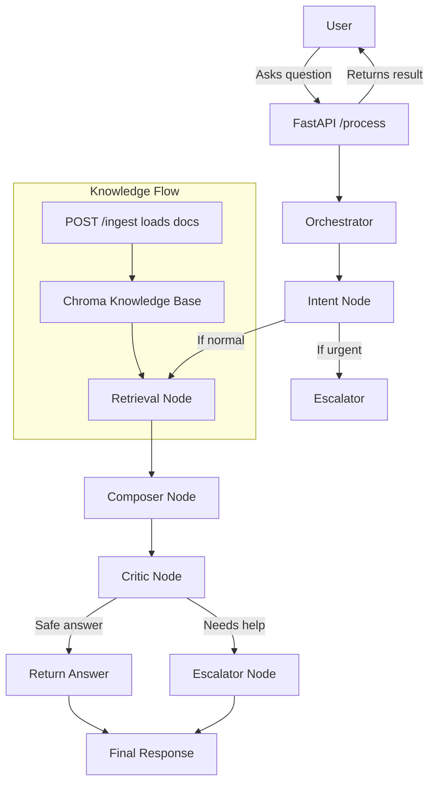

# InsightDesk Project Explanation

## What is InsightDesk?
InsightDesk is a customer support assistant application built with Python. It is designed to answer questions by searching a knowledge base, composing a response, checking its quality, and optionally sending difficult cases to a human for review.

## Who is this for?
This explanation is for a normal user or someone who is not a developer. It describes what the project does, how the main parts fit together, and how the system works from a user request to a final answer.

## Main idea
When someone asks a question, InsightDesk:
- reads the question,
- finds relevant documents,
- generates an answer based on those documents,
- checks whether the answer is safe and grounded,
- and either returns the answer or marks it for escalation.

## Key components

### 1. Web API layer
The application exposes a web service using FastAPI.
- `GET /health` checks if the service is running.
- `POST /process` sends a user question to the system.
- `POST /ingest` loads the knowledge base documents into the search system.
- `GET /docs/{doc_id}` retrieves a stored document by its ID.

### 2. Knowledge storage
InsightDesk stores its searchable data in a local database powered by ChromaDB.
- The knowledge base contains documents and ticket resolutions.
- These entries are converted into embeddings so the system can find the most relevant information for a question.
- The database is configured to persist on disk so the data stays available across restarts.

### 3. Retrieval and answer composition
When a question arrives, the system performs a retrieval step:
- It searches the knowledge base for relevant documents.
- It passes these documents to an answer composer.
- The composer builds a grounded answer using citations from the documents.

### 4. Critic and escalation
After composing a draft answer, the system checks it with a critic:
- If the answer does not have enough supporting citations,
- or if it appears unreliable,
- the system marks it for escalation to a human.

### 5. Docker support
The project includes Docker configuration so it can run inside a container. This makes it easy to start the application with a simple command.

## Workflow diagram
Below is a visual diagram of the main project workflow.



## How the workflow works

### Step 1: Questions arrive
A user sends a request to `POST /process` with a question. This endpoint is the main entry point for the system.

### Step 2: Orchestrator receives the request
The orchestrator is the central coordinator. It takes the user question and sends it through a series of processing steps.

### Step 3: Intent detection
The system first checks the question to understand its type and urgency:
- Is it a bug report?
- Is it a billing issue?
- Is it urgent?

If the question is urgent, the system can immediately mark it for escalation.

### Step 4: Document retrieval
If the question is not urgent, the system searches the knowledge base for relevant content.
- It uses ChromaDB to find the best matching documents.
- It returns the top matching items as citations.

### Step 5: Answer composition
The retrieved documents are sent to the composer, which generates a draft answer.
- The draft includes citations from the documents.
- The answer is intended to be grounded in the knowledge base.

### Step 6: Critic review
The critic examines the composed answer.
- If the answer lacks citations or seems unreliable, it is escalated.
- Otherwise, it is approved.

### Step 7: Final response
The system returns the final outcome:
- If approved, the answer is returned to the user.
- If escalated, the system marks the case for human review.

## Running the app

### Local Python mode
To run the app locally without Docker:
1. Create a Python virtual environment.
2. Install requirements from `requirements.txt`.
3. Generate the demo knowledge documents.
4. Ingest the documents with `python -m app.rag.ingest`.
5. Start the API with `uvicorn app.main:app --reload`.

### Docker mode
The project has Docker support via `Dockerfile` and `docker-compose.yml`.
- The service listens on port `8000` on the host.
- The knowledge data is stored in a mounted `./data` folder.
- ChromaDB persistence is stored in `/data/chroma` inside the container.

A normal user can start the whole app with:

```bash
docker compose up --build
```

## Why this project is useful

InsightDesk helps support teams by automating the first steps of answering questions.
- It finds useful information quickly.
- It builds answers that cite the source documents.
- It adds safety checks so uncertain responses can be reviewed by a human.

## Summary

This project is a structured customer support assistant built around a query pipeline:
- receive the question,
- classify and retrieve relevant information,
- compose an answer,
- verify it,
- and either return it or escalate it.

The included Docker setup makes it easy to run the entire system end-to-end, while the API endpoints provide a simple interface for users and applications to interact with the service.